**Отчет по лабораторной работе №6** 

**По курсу: Основы программирования**

**Выполнил студент гр. 4917 В.А. Дорофеев**

**Ход работы:**

На сайте GitHub сделал копию лабораторной работы https://github.com/Kurtyanik/LR6/

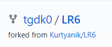

Далее ввел имя и email пользователя, тем самым настроив клиент

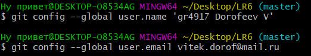

С помощью команды _mkdir ~/Desktop/LR6_ перешел на рабочий стол и создал папку LR6, после чего перешел в нее с помощью команды _cd ~/Desktop/LR6_ и инициализировал гит в данной папке посредством _git init_

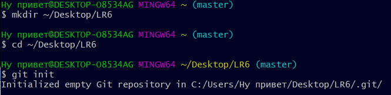

Командой _git remote add origin_ связал папку с удаленным репозиторием и командой _git clone_ клонировал удаленный репозиторий на компьютер на сайте GitHub

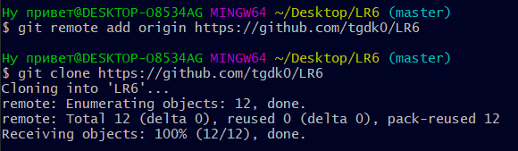

Добавил новый файл file.txt в удаленный репозиторий, в ветку **master**, через интерфейс GitHub

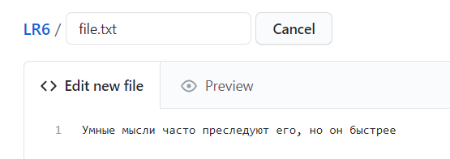

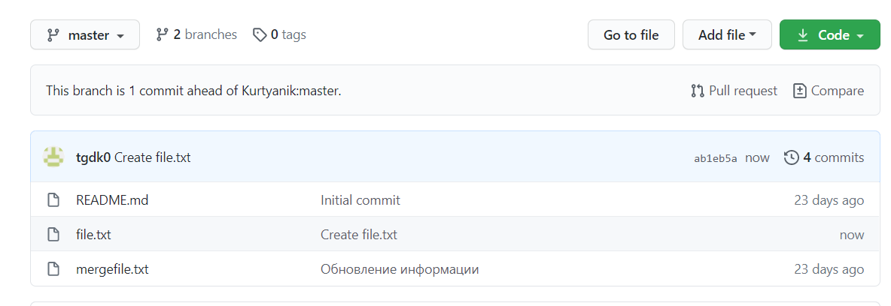

Далее, используя команду _git pull origin master_ загрузил изменения из удалённого репозитория в локальный

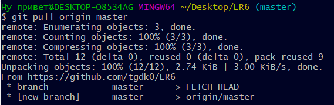

Командой _git log_ получил список коммитов и операций

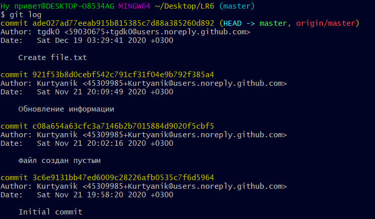

Используя _git show_ получил  информацию о последнем изменении

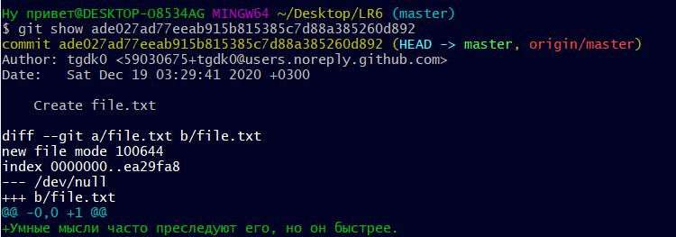

Командой _git checkout -t branch1_ попытался переключиться на ветку **branch1**, но выдало ошибку. Поэтому обновил подключение к сайту GitHub при помощи команды _git remote update_ и повторил попытку

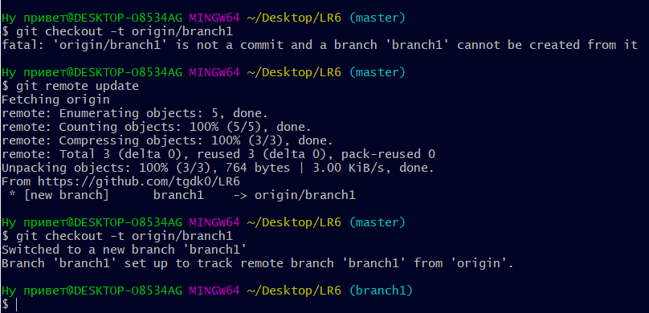

Далее попытался выполнить слияние веток **master** и **branch1** командой _git merge branch1_, но получил очередную ошибку, заключавшуюся в конфликте в файле **mergefile.txt**

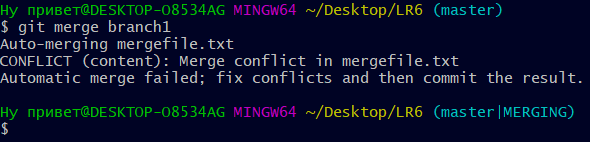

Для ее разрешения вручную изменил содержание файла **mergefile.txt**, устранив ошибку слияния и выполнил коммит

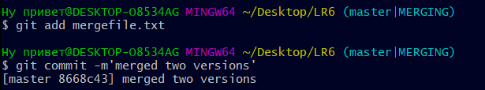

Выполнил слияние веток **master** и **branch1**  с помощью команды _git merge branch1_, затем удалив ветку **branch1** командой _git branch -d branch1_

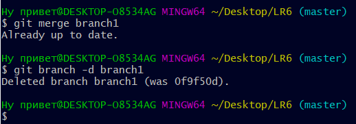

Занес всё в удалённый репозиторий командой _git push -f origin master_ 

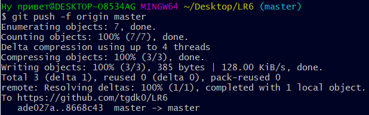

Далее добавил два новых текстовых файла (file2+file3)

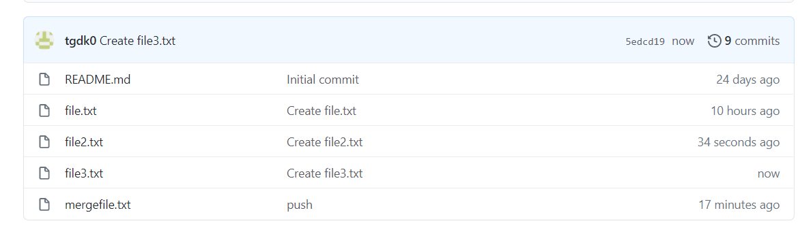

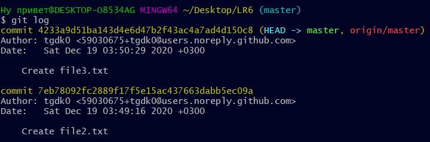

Командой _git reset --hard HEAD~1_ выполнил откат последнего коммита - добавления файла file3.txt

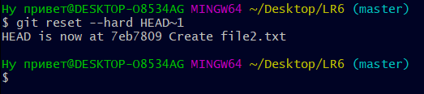

После чего занес измененную ветку в удаленный репозиторий

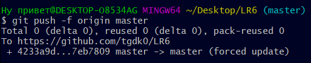

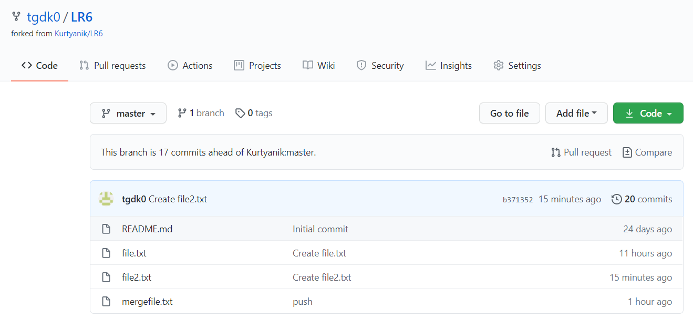

Используя команду _git checkout -b otchet_ создал новую ветку **otchet**

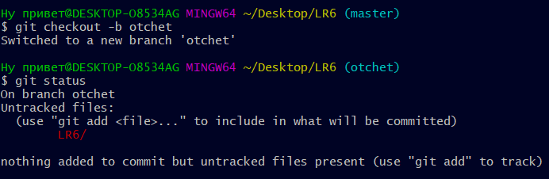

История _git log --graph_. Аргумент _--graph_ позволяет графически изобразить ветки и коммиты на них

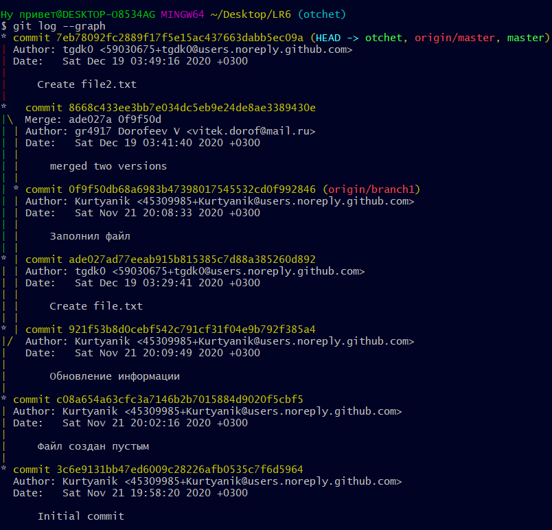

С помощью команды _git add ._ подготовил все новые файлы в папке LR6 к добавлению и занес в удаленный репозиторий

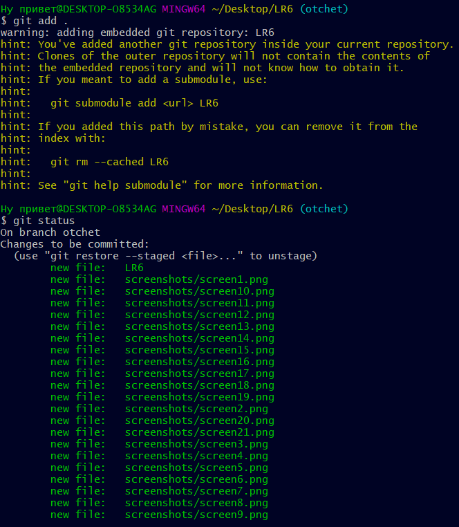

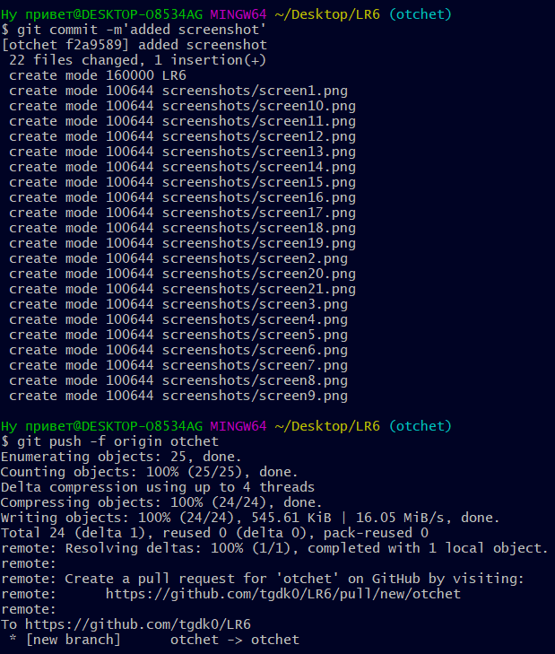

Оформил отчёт в файле **README.md**, используя блокнот

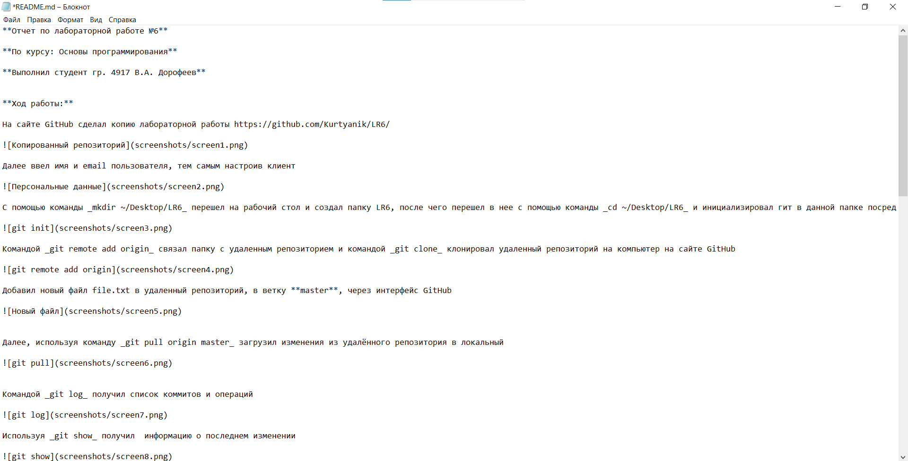

Лог команд из папки **.git/logs**

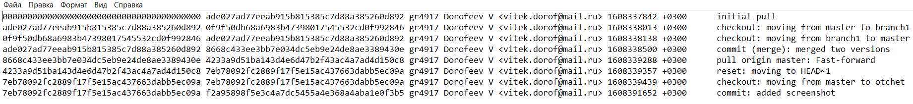

Конечный результат команды _git log_

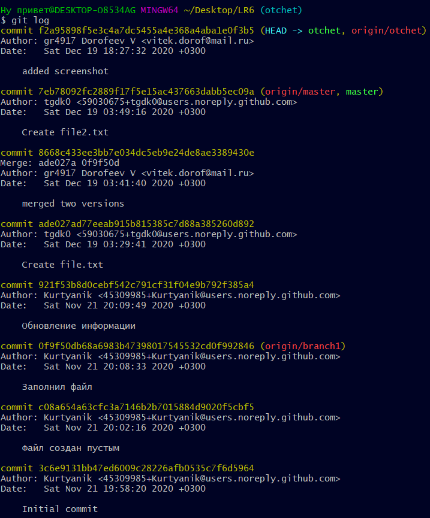

Все скриншоты лежат в папке **screenshots**